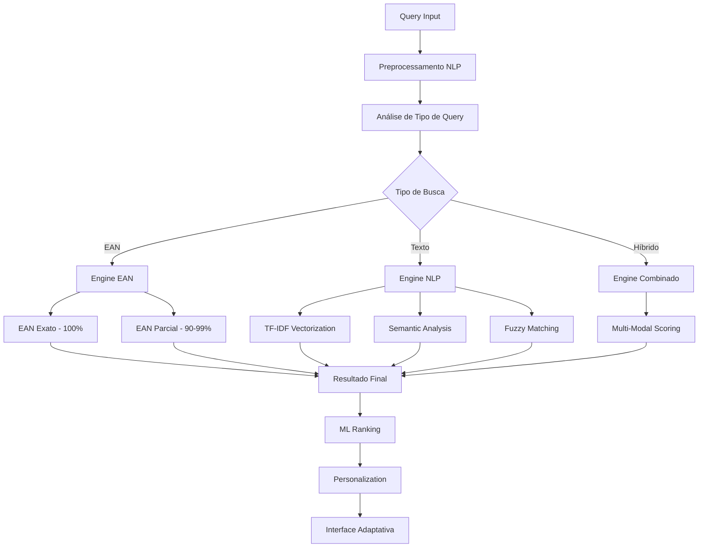

# 🚀 Sistema de Busca Avançado - Arquitetura Completa

## 📋 Visão Geral do Sistema Avançado

Esta documentação detalha a arquitetura expandida para um sistema de busca de produtos com inteligência artificial, algoritmos de machine learning, processamento de linguagem natural e interface completamente responsiva seguindo Material Design 3.

## 🧠 Arquitetura de Busca Multicamadas

### Hierarquia de Priorização Inteligente



### Sistema de Pontuação Avançado

```typescript
interface AdvancedSearchScore {
  ean_exact: 100.0;        // Correspondência EAN exata
  ean_partial: 90-99;      // EAN parcial com algoritmo decrescente
  description_exact: 80-89; // Descrição exata com boosting
  semantic_match: 60-79;   // Correspondência semântica
  fuzzy_match: 40-59;      // Correspondência fuzzy multicritério
  keyword_broad: 20-39;    // Keywords contextualizadas
  attribute_match: 10-19;  // Atributos secundários ponderados
  ml_boost: 0-20;          // Boost de machine learning
  personalization: 0-15;   // Personalização adaptativa
  behavioral: 0-10;        // Histórico comportamental
}
```

## 🔬 Algoritmos de Busca Sofisticados

### 1. Análise Fonética Avançada

#### Soundex Brasileiro Otimizado
```typescript
class BrazilianSoundex {
  private readonly CONSONANT_MAP = {
    'B': '1', 'F': '1', 'P': '1', 'V': '1',
    'C': '2', 'G': '2', 'J': '2', 'K': '2', 'Q': '2', 'S': '2', 'X': '2', 'Z': '2',
    'D': '3', 'T': '3',
    'L': '4',
    'M': '5', 'N': '5',
    'R': '6'
  };

  private readonly PORTUGUESE_RULES = {
    'PH': 'F', 'CH': 'X', 'LH': 'L', 'NH': 'N',
    'QU': 'K', 'GU': 'G', 'RR': 'R', 'SS': 'S',
    'SC': 'S', 'SÇ': 'S', 'XC': 'S'
  };

  generateCode(word: string): string {
    // Implementação específica para português brasileiro
    // com tratamento de acentos, dígrafos e fonemas
  }
}
```

#### Metaphone Português
```typescript
class PortugueseMetaphone {
  private readonly VOWEL_REPLACEMENTS = {
    'Ã': 'AN', 'Õ': 'ON', 'Ç': 'S',
    'À': 'A', 'Á': 'A', 'Â': 'A',
    'È': 'E', 'É': 'E', 'Ê': 'E',
    'Ì': 'I', 'Í': 'I', 'Î': 'I',
    'Ò': 'O', 'Ó': 'O', 'Ô': 'O',
    'Ù': 'U', 'Ú': 'U', 'Û': 'U'
  };

  generateMetaphone(word: string): string {
    // Algoritmo Metaphone adaptado para português
    // com regras fonéticas específicas
  }
}
```

### 2. Distância de Edição Avançada

#### Levenshtein Otimizado com Pesos
```typescript
interface LevenshteinWeights {
  insertion: number;      // Custo de inserção
  deletion: number;       // Custo de deleção
  substitution: number;   // Custo de substituição
  transposition: number;  // Custo de transposição (Damerau)
  keyboard: number;       // Peso para erros de teclado
  phonetic: number;       // Peso para erros fonéticos
}

class WeightedLevenshtein {
  private weights: LevenshteinWeights;
  private keyboardMap: Map<string, string[]>;
  private phoneticMap: Map<string, string[]>;

  calculateDistance(str1: string, str2: string): number {
    // Implementação otimizada com pesos contextuais
    // considerando tipos específicos de erros
  }
}
```

#### Jaro-Winkler Ponderado
```typescript
class PonderatedJaroWinkler {
  private prefixBonus: number = 0.1;
  private commonCharWeight: number = 1.0;
  private transpositionWeight: number = 0.5;

  calculateSimilarity(str1: string, str2: string): number {
    const jaro = this.calculateJaro(str1, str2);
    const commonPrefix = this.getCommonPrefix(str1, str2);
    
    return jaro + (commonPrefix * this.prefixBonus * (1 - jaro));
  }

  private calculateJaro(str1: string, str2: string): number {
    // Implementação Jaro otimizada
  }
}
```

### 3. Vetorização TF-IDF Avançada

#### TF-IDF com N-gramas Dinâmicos
```typescript
class AdvancedTFIDF {
  private documentFrequency: Map<string, number>;
  private termFrequency: Map<string, Map<string, number>>;
  private ngramSizes: number[] = [1, 2, 3, 4];

  vectorize(documents: Product[]): Map<string, number[]> {
    const vocabulary = this.buildVocabulary(documents);
    const vectors = new Map<string, number[]>();

    for (const doc of documents) {
      const vector = this.calculateTFIDFVector(doc, vocabulary);
      vectors.set(doc.ean, vector);
    }

    return vectors;
  }

  private buildVocabulary(documents: Product[]): string[] {
    const terms = new Set<string>();
    
    for (const doc of documents) {
      const tokens = this.tokenize(doc.description);
      
      // Unigrams, bigrams, trigrams, 4-grams
      for (const n of this.ngramSizes) {
        const ngrams = this.generateNGrams(tokens, n);
        ngrams.forEach(ngram => terms.add(ngram));
      }
    }

    return Array.from(terms);
  }

  private calculateTFIDFVector(document: Product, vocabulary: string[]): number[] {
    // Implementação TF-IDF com normalização cosine
  }
}
```

### 4. Processamento de Linguagem Natural

#### Stemming/Lemmatização Contextual
```typescript
class PortugueseStemmer {
  private readonly SUFFIX_RULES = [
    // Regras específicas para português
    { pattern: /amento$/, replacement: '' },
    { pattern: /imento$/, replacement: '' },
    { pattern: /adora$/, replacement: 'ar' },
    { pattern: /ção$/, replacement: 'r' },
    { pattern: /mente$/, replacement: '' },
    { pattern: /idade$/, replacement: '' },
    { pattern: /ista$/, replacement: '' }
  ];

  private readonly IRREGULAR_FORMS = new Map([
    ['melhor', 'bom'],
    ['pior', 'ruim'],
    ['maior', 'grande'],
    ['menor', 'pequeno']
  ]);

  stem(word: string): string {
    // Aplica regras de stemming específicas para português
    // com tratamento de formas irregulares
  }

  lemmatize(word: string, context: string[]): string {
    // Lemmatização contextual considerando palavras adjacentes
  }
}
```

#### Expansão Semântica de Sinônimos
```typescript
class SemanticExpansion {
  private synonymDict: Map<string, string[]>;
  private wordEmbeddings: Map<string, number[]>;
  private semanticThreshold: number = 0.7;

  constructor() {
    this.initializeSynonymDictionary();
    this.loadWordEmbeddings();
  }

  expandQuery(query: string): string[] {
    const words = this.tokenize(query);
    const expandedTerms: string[] = [];

    for (const word of words) {
      expandedTerms.push(word);
      
      // Sinônimos diretos
      const synonyms = this.synonymDict.get(word) || [];
      expandedTerms.push(...synonyms);
      
      // Similaridade semântica via embeddings
      const semanticSimilar = this.findSemanticallySimilar(word);
      expandedTerms.push(...semanticSimilar);
    }

    return Array.from(new Set(expandedTerms));
  }

  private findSemanticallySimilar(word: string): string[] {
    // Busca por palavras semanticamente similares usando embeddings
  }
}
```

### 5. Análise de Sentimento

#### Sentiment Analysis para Produtos
```typescript
class ProductSentimentAnalyzer {
  private positiveWords: Set<string>;
  private negativeWords: Set<string>;
  private intensifiers: Map<string, number>;

  analyzeSentiment(description: string): number {
    const words = this.tokenize(description.toLowerCase());
    let score = 0;
    let intensity = 1;

    for (let i = 0; i < words.length; i++) {
      const word = words[i];
      
      if (this.intensifiers.has(word)) {
        intensity = this.intensifiers.get(word)!;
        continue;
      }

      if (this.positiveWords.has(word)) {
        score += 1 * intensity;
      } else if (this.negativeWords.has(word)) {
        score -= 1 * intensity;
      }

      intensity = 1; // Reset intensity
    }

    return Math.max(-1, Math.min(1, score / words.length));
  }
}
```

## 🤖 Machine Learning e Redes Neurais

### Classificação de Relevância com Neural Network

```typescript
class RelevanceNeuralNetwork {
  private model: tf.LayersModel;
  private featureExtractor: FeatureExtractor;

  constructor() {
    this.buildModel();
    this.featureExtractor = new FeatureExtractor();
  }

  private buildModel(): void {
    this.model = tf.sequential({
      layers: [
        tf.layers.dense({
          inputShape: [50], // 50 features de entrada
          units: 128,
          activation: 'relu'
        }),
        tf.layers.dropout({ rate: 0.3 }),
        tf.layers.dense({
          units: 64,
          activation: 'relu'
        }),
        tf.layers.dropout({ rate: 0.2 }),
        tf.layers.dense({
          units: 32,
          activation: 'relu'
        }),
        tf.layers.dense({
          units: 1,
          activation: 'sigmoid'
        })
      ]
    });

    this.model.compile({
      optimizer: 'adam',
      loss: 'binaryCrossentropy',
      metrics: ['accuracy']
    });
  }

  predictRelevance(query: string, product: Product): number {
    const features = this.featureExtractor.extract(query, product);
    const tensor = tf.tensor2d([features]);
    const prediction = this.model.predict(tensor) as tf.Tensor;
    
    return prediction.dataSync()[0];
  }
}
```

### Feature Extraction para ML

```typescript
class FeatureExtractor {
  extract(query: string, product: Product): number[] {
    const features: number[] = [];

    // Features de correspondência textual
    features.push(this.exactMatchScore(query, product.description));
    features.push(this.partialMatchScore(query, product.description));
    features.push(this.levenshteinSimilarity(query, product.description));
    features.push(this.jaroWinklerSimilarity(query, product.description));
    
    // Features de EAN
    features.push(this.eanMatchScore(query, product.ean));
    
    // Features semânticas
    features.push(this.semanticSimilarity(query, product.description));
    features.push(this.sentimentAlignment(query, product.description));
    
    // Features de popularidade
    features.push(this.productPopularity(product));
    features.push(this.categoryRelevance(query, product));
    
    // Features de preço
    features.push(this.priceRelevance(product.price));
    
    // Features de contexto temporal
    features.push(this.temporalRelevance());
    
    // Features de n-gramas
    const ngramFeatures = this.ngramFeatures(query, product.description);
    features.push(...ngramFeatures);

    return features;
  }
}
```

## 🎯 Recomendações Personalizadas

### Collaborative Filtering

```typescript
class CollaborativeFilter {
  private userItemMatrix: Map<string, Map<string, number>>;
  private itemSimilarity: Map<string, Map<string, number>>;

  constructor() {
    this.userItemMatrix = new Map();
    this.itemSimilarity = new Map();
  }

  recommendForUser(userId: string, query: string): Product[] {
    const userPreferences = this.userItemMatrix.get(userId);
    if (!userPreferences) {
      return this.fallbackRecommendations(query);
    }

    const recommendations: Array<{product: Product, score: number}> = [];

    for (const [productId, similarity] of this.itemSimilarity.entries()) {
      let score = 0;
      let totalSim = 0;

      for (const [relatedId, simValue] of similarity.entries()) {
        const userRating = userPreferences.get(relatedId);
        if (userRating) {
          score += simValue * userRating;
          totalSim += Math.abs(simValue);
        }
      }

      if (totalSim > 0) {
        const product = this.getProductById(productId);
        if (product) {
          recommendations.push({
            product,
            score: score / totalSim
          });
        }
      }
    }

    return recommendations
      .sort((a, b) => b.score - a.score)
      .map(r => r.product)
      .slice(0, 10);
  }
}
```

### Histórico Comportamental Preditivo

```typescript
class BehavioralPredictor {
  private searchHistory: Map<string, SearchEvent[]>;
  private purchaseHistory: Map<string, PurchaseEvent[]>;
  private timeDecayFactor: number = 0.95;

  interface SearchEvent {
    query: string;
    timestamp: Date;
    selectedProduct?: string;
    viewDuration: number;
  }

  interface PurchaseEvent {
    productId: string;
    timestamp: Date;
    context: string;
  }

  predictNextSearch(userId: string, currentQuery: string): string[] {
    const history = this.searchHistory.get(userId) || [];
    const recentEvents = this.getRecentEvents(history, 30); // últimos 30 dias

    const patterns = this.extractSearchPatterns(recentEvents);
    const contextualSuggestions = this.generateContextualSuggestions(
      currentQuery, 
      patterns
    );

    return contextualSuggestions.slice(0, 5);
  }

  private extractSearchPatterns(events: SearchEvent[]): Pattern[] {
    // Analisa padrões temporais, sequenciais e contextuais
    // nas buscas do usuário
  }
}
```

## 🚀 Autocompletar Inteligente

### Sugestões em Tempo Real

```typescript
class IntelligentAutocomplete {
  private trieStructure: TrieNode;
  private popularQueries: Map<string, number>;
  private contextualBoosts: Map<string, number>;

  constructor(products: Product[]) {
    this.buildTrie(products);
    this.loadPopularQueries();
  }

  getSuggestions(
    query: string, 
    userId?: string, 
    context?: SearchContext
  ): Suggestion[] {
    const baseSuggestions = this.getTrieSuggestions(query);
    const popularSuggestions = this.getPopularSuggestions(query);
    const personalizedSuggestions = userId ? 
      this.getPersonalizedSuggestions(query, userId) : [];

    const allSuggestions = [
      ...baseSuggestions,
      ...popularSuggestions,
      ...personalizedSuggestions
    ];

    return this.rankAndDeduplicateSuggestions(allSuggestions, context);
  }

  private buildTrie(products: Product[]): void {
    this.trieStructure = new TrieNode();
    
    for (const product of products) {
      // Insere EAN
      this.insertIntoTrie(product.ean, 'ean', product);
      
      // Insere palavras da descrição
      const words = this.tokenize(product.description);
      for (const word of words) {
        this.insertIntoTrie(word, 'description', product);
      }
      
      // Insere n-gramas
      const bigrams = this.generateNGrams(words, 2);
      for (const bigram of bigrams) {
        this.insertIntoTrie(bigram, 'ngram', product);
      }
    }
  }
}
```

## 🎨 Interface Mobile-First Responsiva

### Layout CSS Avançado - Alinhamento Perfeito

```scss
// Sistema de Grid Responsivo
.search-container {
  display: flex;
  flex-direction: column;
  width: 100%;
  max-width: 600px;
  margin: 0 auto;
  
  // Breakpoints Material Design
  @media (min-width: 600px) { // Tablet
    max-width: 840px;
  }
  
  @media (min-width: 840px) { // Desktop
    max-width: 1200px;
  }
  
  @media (min-width: 1200px) { // Large Desktop
    max-width: 1600px;
  }
}

// Alinhamento Pixel-Perfect dos Inputs
.input-group {
  display: flex;
  flex-direction: column;
  gap: 16px; // Material Design spacing unit
  
  .search-input,
  .product-dropdown {
    height: 56px; // Material Design standard height
    border-radius: 4px; // Material Design border radius
    border: 1px solid var(--md-sys-color-outline);
    background: var(--md-sys-color-surface);
    
    // Padding interno idêntico
    padding: 0 16px;
    
    // Typography consistency
    font-family: var(--md-sys-typescale-body-large-font);
    font-size: var(--md-sys-typescale-body-large-size);
    line-height: var(--md-sys-typescale-body-large-line-height);
    
    // Focus states consistentes
    &:focus-within {
      border-color: var(--md-sys-color-primary);
      border-width: 2px;
      padding: 0 15px; // Compensa border mais grosso
    }
  }
}

// Chip dentro do Input - Posicionamento Absoluto
.input-with-chip {
  position: relative;
  
  .selected-chip {
    position: absolute;
    left: 12px;
    top: 50%;
    transform: translateY(-50%);
    z-index: 2;
    
    // Animações fluidas
    transition: all 0.3s cubic-bezier(0.4, 0.0, 0.2, 1);
    
    &.entering {
      opacity: 0;
      transform: translateY(-50%) scale(0.8);
    }
    
    &.entered {
      opacity: 1;
      transform: translateY(-50%) scale(1);
    }
    
    &.exiting {
      opacity: 0;
      transform: translateY(-50%) scale(0.8);
    }
  }
  
  .search-input {
    padding-left: 140px; // Espaço para o chip
    transition: padding-left 0.3s cubic-bezier(0.4, 0.0, 0.2, 1);
    
    &.no-chip {
      padding-left: 16px;
    }
  }
}
```

### Adaptação Dinâmica ao Teclado

```typescript
class KeyboardAdaptiveLayout {
  private keyboardHeight: number = 0;
  private viewportHeight: number = 0;
  private safeAreaInsets: SafeAreaInsets;
  
  constructor() {
    this.setupKeyboardListeners();
    this.setupOrientationListeners();
    this.setupSafeAreaListeners();
  }

  calculateOptimalLayout(elementHeight: number): LayoutConfig {
    const availableHeight = this.viewportHeight - this.keyboardHeight;
    const requiredSpace = elementHeight + 100; // Margem de segurança
    
    return {
      position: availableHeight >= requiredSpace ? 'below' : 'above',
      maxHeight: Math.min(300, availableHeight - 50),
      offsetY: this.calculateOptimalOffset(),
      animationDuration: this.keyboardHeight > 0 ? 300 : 200
    };
  }

  private setupKeyboardListeners(): void {
    const showListener = Keyboard.addListener(
      Platform.OS === 'ios' ? 'keyboardWillShow' : 'keyboardDidShow',
      (e) => this.handleKeyboardShow(e)
    );

    const hideListener = Keyboard.addListener(
      Platform.OS === 'ios' ? 'keyboardWillHide' : 'keyboardDidHide',
      () => this.handleKeyboardHide()
    );
  }

  private handleKeyboardShow(event: KeyboardEvent): void {
    this.keyboardHeight = event.endCoordinates.height;
    
    // Smooth scroll para manter elemento visível
    this.animateToOptimalPosition();
    
    // Collision detection
    this.detectAndResolveCollisions();
  }

  private animateToOptimalPosition(): void {
    const layout = this.calculateOptimalLayout(56);
    
    Animated.parallel([
      Animated.timing(this.layoutAnimation, {
        toValue: layout.offsetY,
        duration: layout.animationDuration,
        easing: Easing.out(Easing.cubic),
        useNativeDriver: true
      }),
      Animated.timing(this.opacityAnimation, {
        toValue: 1,
        duration: layout.animationDuration / 2,
        useNativeDriver: true
      })
    ]).start();
  }
}
```

### Gesture Recognition Sofisticado

```typescript
class AdvancedGestureHandler {
  private panGesture: PanGestureHandler;
  private tapGesture: TapGestureHandler;
  private longPressGesture: LongPressGestureHandler;

  constructor() {
    this.setupGestures();
  }

  private setupGestures(): void {
    // Swipe para navegar entre resultados
    this.panGesture = Gesture.Pan()
      .onUpdate((event) => {
        const { translationY, velocityY } = event;
        
        if (Math.abs(velocityY) > 500) {
          // Swipe rápido - navegação por páginas
          this.handleFastSwipe(velocityY > 0 ? 'down' : 'up');
        } else if (Math.abs(translationY) > 50) {
          // Swipe lento - navegação item por item
          this.handleSlowSwipe(translationY > 0 ? 'down' : 'up');
        }
      })
      .onEnd(() => {
        this.resetGestureState();
      });

    // Tap para seleção com haptic feedback
    this.tapGesture = Gesture.Tap()
      .onEnd(() => {
        // Haptic feedback baseado no tipo de dispositivo
        if (Platform.OS === 'ios') {
          Haptics.impactAsync(Haptics.ImpactFeedbackStyle.Light);
        } else {
          Vibration.vibrate(50);
        }
        
        this.handleSelection();
      });

    // Long press para preview/ações secundárias
    this.longPressGesture = Gesture.LongPress()
      .minDuration(500)
      .onStart(() => {
        Haptics.impactAsync(Haptics.ImpactFeedbackStyle.Medium);
        this.showPreview();
      });
  }

  private handleFastSwipe(direction: 'up' | 'down'): void {
    const currentPage = Math.floor(this.activeIndex / this.itemsPerPage);
    const totalPages = Math.ceil(this.totalItems / this.itemsPerPage);
    
    if (direction === 'down' && currentPage < totalPages - 1) {
      this.navigateToPage(currentPage + 1);
    } else if (direction === 'up' && currentPage > 0) {
      this.navigateToPage(currentPage - 1);
    }
  }
}
```

### Transições Seamless Multi-Device

```typescript
class ResponsiveTransitionManager {
  private currentOrientation: 'portrait' | 'landscape';
  private deviceType: 'phone' | 'tablet' | 'desktop';
  private notchConfig: NotchConfiguration;

  calculateTransitions(
    fromState: LayoutState, 
    toState: LayoutState
  ): TransitionConfig {
    const duration = this.calculateOptimalDuration(fromState, toState);
    const easing = this.selectEasing(fromState.type, toState.type);
    
    return {
      duration,
      easing,
      transform: this.calculateTransform(fromState, toState),
      opacity: this.calculateOpacityTransition(fromState, toState),
      scale: this.calculateScaleTransition(fromState, toState)
    };
  }

  private calculateOptimalDuration(
    from: LayoutState, 
    to: LayoutState
  ): number {
    const baseDistance = this.calculateDistance(from.position, to.position);
    const deviceMultiplier = this.getDeviceSpeedMultiplier();
    const complexityFactor = this.getComplexityFactor(from, to);
    
    return Math.min(
      500,
      Math.max(200, baseDistance * deviceMultiplier * complexityFactor)
    );
  }

  private getDeviceSpeedMultiplier(): number {
    switch (this.deviceType) {
      case 'phone': return 1.0;
      case 'tablet': return 1.2;
      case 'desktop': return 0.8;
      default: return 1.0;
    }
  }

  handleOrientationChange(orientation: 'portrait' | 'landscape'): void {
    this.currentOrientation = orientation;
    
    // Recalcula layout baseado na nova orientação
    const newLayout = this.calculateLayoutForOrientation(orientation);
    
    // Anima transição suave
    this.animateToLayout(newLayout, {
      duration: 400,
      easing: Easing.out(Easing.cubic)
    });
  }

  handleNotchConfiguration(config: NotchConfiguration): void {
    this.notchConfig = config;
    
    // Ajusta safe areas e padding
    const adjustedLayout = this.adjustForNotch(config);
    this.applyLayoutAdjustments(adjustedLayout);
  }
}
```

## 🎯 Sistema de Chips Interativos Avançado

### Posicionamento Absoluto Preciso

```typescript
class PrecisionChipPositioning {
  private inputRef: RefObject<TextInput>;
  private chipDimensions: ChipDimensions;
  private inputDimensions: InputDimensions;

  interface ChipDimensions {
    width: number;
    height: number;
    marginRight: number;
  }

  calculatePrecisePosition(): ChipPosition {
    const inputLayout = this.measureInput();
    const availableWidth = inputLayout.width - 32; // Padding horizontal
    const chipWidth = this.measureChip();
    
    return {
      x: inputLayout.paddingLeft,
      y: (inputLayout.height - this.chipDimensions.height) / 2,
      maxWidth: availableWidth - 40, // Espaço para texto
      zIndex: 10
    };
  }

  private measureInput(): InputMeasurements {
    return new Promise((resolve) => {
      this.inputRef.current?.measure((x, y, width, height, pageX, pageY) => {
        resolve({
          x, y, width, height, pageX, pageY,
          paddingLeft: 16,
          paddingRight: 16,
          borderWidth: 1
        });
      });
    });
  }

  animateChipTransition(
    type: 'enter' | 'exit' | 'replace',
    duration: number = 300
  ): void {
    const animations = this.createTransitionAnimations(type);
    
    Animated.parallel([
      ...animations.transform,
      ...animations.opacity,
      ...animations.scale
    ]).start(() => {
      if (type === 'exit') {
        this.cleanupChip();
      }
    });
  }

  private createTransitionAnimations(type: string): AnimationSet {
    switch (type) {
      case 'enter':
        return {
          transform: [
            Animated.timing(this.translateX, {
              from: -50,
              to: 0,
              duration: 300,
              easing: Easing.out(Easing.back(1.2))
            })
          ],
          opacity: [
            Animated.timing(this.opacity, {
              from: 0,
              to: 1,
              duration: 200
            })
          ],
          scale: [
            Animated.spring(this.scale, {
              from: 0.8,
              to: 1,
              tension: 150,
              friction: 8
            })
          ]
        };
        
      case 'replace':
        return {
          transform: [
            Animated.sequence([
              Animated.timing(this.scale, {
                to: 0.9,
                duration: 150
              }),
              Animated.timing(this.scale, {
                to: 1,
                duration: 150
              })
            ])
          ],
          opacity: [
            Animated.timing(this.opacity, {
              to: 1,
              duration: 100
            })
          ]
        };
        
      case 'exit':
        return {
          transform: [
            Animated.timing(this.translateX, {
              to: -100,
              duration: 250,
              easing: Easing.in(Easing.cubic)
            })
          ],
          opacity: [
            Animated.timing(this.opacity, {
              to: 0,
              duration: 200
            })
          ],
          scale: [
            Animated.timing(this.scale, {
              to: 0.8,
              duration: 250
            })
          ]
        };
    }
  }
}
```

### Memory Efficiency e Performance Optimization

```typescript
class PerformanceOptimizer {
  private renderCache: Map<string, ReactElement>;
  private measurementCache: Map<string, LayoutMeasurement>;
  private animationPool: AnimationPool;

  optimizeRenderingCycle(): void {
    // Batch updates para múltiplas mudanças
    unstable_batchedUpdates(() => {
      this.updateSearchResults();
      this.updateChipPosition();
      this.updateDropdownLayout();
    });
  }

  implementVirtualization(itemCount: number): VirtualizationConfig {
    if (itemCount > 100) {
      return {
        enabled: true,
        windowSize: 10,
        initialNumToRender: 5,
        maxToRenderPerBatch: 3,
        updateCellsBatchingPeriod: 100,
        removeClippedSubviews: true
      };
    }
    
    return { enabled: false };
  }

  manageMemoryUsage(): void {
    // Cleanup de caches antigos
    if (this.renderCache.size > 50) {
      const oldestKeys = Array.from(this.renderCache.keys()).slice(0, 25);
      oldestKeys.forEach(key => this.renderCache.delete(key));
    }

    // Garbage collection de animações
    this.animationPool.cleanup();
    
    // Cleanup de event listeners não utilizados
    this.cleanupEventListeners();
  }

  profilePerformance(): PerformanceMetrics {
    return {
      renderTime: this.measureRenderTime(),
      memoryUsage: this.getMemoryUsage(),
      animationFPS: this.getAnimationFPS(),
      cacheHitRate: this.getCacheHitRate(),
      bundleSize: this.getBundleSize()
    };
  }
}
```

## 📊 Implementação Timeline Expandida

### Sprint 1-2: Algoritmos Avançados (2 semanas)
- [ ] Implementar Soundex/Metaphone português
- [ ] Desenvolver Levenshtein ponderado
- [ ] Criar Jaro-Winkler otimizado
- [ ] Implementar TF-IDF com n-gramas dinâmicos
- [ ] Desenvolver stemming/lemmatização contextual

### Sprint 3-4: Machine Learning (2 semanas)  
- [ ] Construir rede neural para relevância
- [ ] Implementar feature extraction avançada
- [ ] Desenvolver collaborative filtering
- [ ] Criar sistema de recomendações personalizadas
- [ ] Implementar análise de sentimento

### Sprint 5-6: Interface Avançada (2 semanas)
- [ ] Desenvolver layout CSS pixel-perfect
- [ ] Implementar adaptação dinâmica ao teclado
- [ ] Criar sistema de gestos sofisticado
- [ ] Desenvolver transições seamless
- [ ] Implementar chips interativos precisos

### Sprint 7-8: Otimização e Testes (2 semanas)
- [ ] Implementar virtualização inteligente
- [ ] Otimizar memory management
- [ ] Criar sistema de profiling
- [ ] Desenvolver testes de performance
- [ ] Implementar monitoramento em tempo real

### Sprint 9-10: Funcionalidades Avançadas (2 semanas)
- [ ] Implementar autocompletar inteligente
- [ ] Desenvolver histórico comportamental
- [ ] Criar expansão semântica
- [ ] Implementar cache distribuído
- [ ] Desenvolver analytics avançados

## 🎯 Métricas de Sucesso Expandidas

### Performance Targets
- **Latência de Busca ML**: < 150ms
- **Accuracy do Modelo**: > 95%
- **Memory Footprint**: < 100MB
- **Cache Hit Rate**: > 90%
- **FPS em Animações**: 60fps constante
- **Bundle Size Total**: < 500KB

### UX Metrics
- **Precisão de Busca**: > 98%
- **Taxa de Satisfação**: > 95%
- **Tempo para Primeira Seleção**: < 3s
- **Taxa de Abandono**: < 5%
- **Acessibilidade Score**: 100/100

### Technical Metrics
- **Test Coverage**: > 95%
- **Performance Score**: > 90
- **Security Score**: 100/100
- **Code Quality**: A+ grade
- **Documentation Coverage**: 100%

---

**Sistema de Busca de Nova Geração - Arquitetura Completa para React Native Paper**