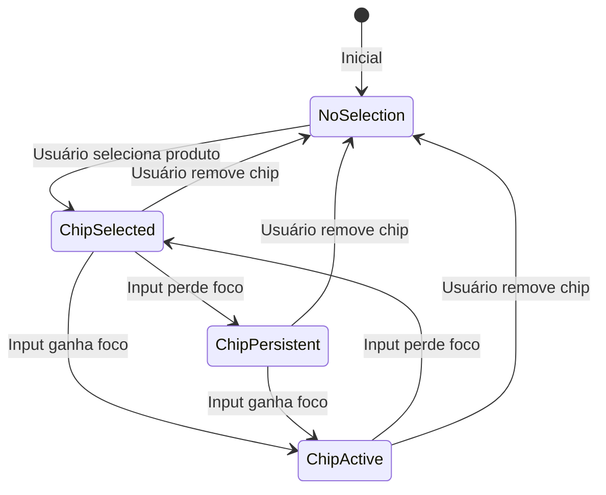
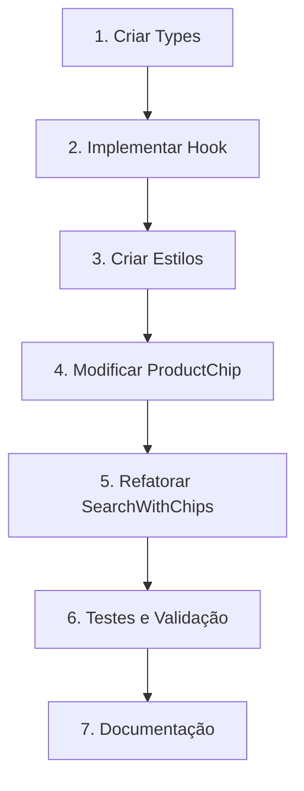

# Plano de Implementação: Estado Persistente de Chips

## Visão Geral

Este documento detalha o plano para resolver o problema de sobreposição entre o rótulo do TextInput e o componente Chip no sistema React Native Paper, implementando um sistema de estado persistente que mantém a seleção visual do chip independentemente do foco do input.

## Problema Identificado

### Descrição
Quando um campo TextInput `react-native-paper` perde o foco, o rótulo se move para dentro da área do campo. Se houver um componente Chip representando um item selecionado posicionado lá, o rótulo acaba se sobrepondo ao chip, prejudicando a visualização da interface do usuário.

### Comportamento Atual
- O chip não mantém estado visual consistente após perder o foco
- Falta de persistência visual da seleção
- Conflitos de posicionamento entre label e chip
- Gerenciamento de estado inadequado para eventos de foco/blur

## Solução Proposta

### Arquitetura do Sistema de Estados



### Estados do Chip

| Estado | Descrição | Comportamento Visual |
|--------|-----------|---------------------|
| `none` | Nenhum chip selecionado | Input normal, sem chip |
| `selected` | Chip selecionado, input não focado | Chip visível, label customizado |
| `active` | Chip selecionado e input focado | Chip + input ativo |
| `persistent` | Estado mantido após blur | Chip permanece visível até ação explícita |

## Componentes a Implementar/Modificar

### 1. Hook: `useChipPersistentState`

**Arquivo**: `src/hooks/useChipPersistentState.ts`

**Responsabilidades**:
- Gerenciar estados do chip: `none`, `selected`, `active`, `persistent`
- Controlar transições baseadas em eventos de foco/blur
- Manter histórico de seleções para melhor UX
- Fornecer métodos para manipulação de estado

**Interface**:
```typescript
interface ChipPersistentState {
  state: ChipState;
  selectedProduct: Product | null;
  isInputFocused: boolean;
  isPersistent: boolean;
}

interface ChipPersistentActions {
  selectProduct: (product: Product) => void;
  removeProduct: () => void;
  setInputFocus: (focused: boolean) => void;
  clearAll: () => void;
}
```

### 2. Tipos: `chipStates.ts`

**Arquivo**: `src/types/chipStates.ts`

**Conteúdo**:
- Definições de tipos para estados do chip
- Interfaces para props e configurações
- Enums para constantes de estado

### 3. Estilos: `chipThemes.ts`

**Arquivo**: `src/styles/chipThemes.ts`

**Responsabilidades**:
- Temas visuais para cada estado do chip
- Configurações de z-index e posicionamento
- Estilos de transição e animação

### 4. Componente Aprimorado: `ProductChip`

**Arquivo**: `src/components/ProductChip.tsx` (modificado)

**Melhorias**:
- Adicionar variante `persistent` para estado sem foco
- Implementar indicadores visuais diferenciados por estado
- Melhorar feedback de acessibilidade para estados persistentes
- Suporte a animações de transição entre estados

**Novas Props**:
```typescript
interface ProductChipProps {
  // ... props existentes
  chipState: ChipState;
  persistent?: boolean;
  showStateIndicator?: boolean;
  animationDuration?: number;
}
```

### 5. Componente Refatorado: `SearchWithChips`

**Arquivo**: `src/components/SearchWithChips.tsx` (modificado)

**Melhorias**:
- Integração com `useChipPersistentState`
- Correção e completação da implementação do `labelOverlay`
- Controle de z-index mais preciso
- Implementação de transições suaves entre estados
- Melhor gerenciamento de eventos de foco/blur

## Fluxo de Implementação



## Recursos Principais

### Persistência Visual
- Chip mantém aparência selecionada independentemente do foco
- Estados bem definidos para diferentes situações
- Transições suaves entre estados

### Gestão de Label
- Label customizado que não conflita com chip
- Posicionamento inteligente baseado no estado
- Controle de sobreposição através de z-index

### Acessibilidade
- Estados ARIA bem definidos: `aria-selected`, `aria-persistent`
- Anúncios claros para screen readers
- Suporte completo para navegação por teclado
- Focus management inteligente

### Controles de Usuário
- **Remoção Explícita**: Através do botão X do chip ou tecla Backspace
- **Seleção Nova**: Substituição automática ao selecionar novo produto
- **Clear All**: Funcionalidade para limpar todas as seleções
- **Persistência**: Estado mantido até ação explícita do usuário

## Padrões de Acessibilidade

### ARIA States
```typescript
// Estados ARIA para diferentes situações
const getAriaStates = (chipState: ChipState) => {
  return {
    'aria-selected': chipState !== 'none',
    'aria-persistent': chipState === 'persistent',
    'aria-expanded': chipState === 'active',
    'aria-live': 'polite'
  };
};
```

### Screen Reader Support
- Anúncios de mudanças de estado
- Descrições claras de ações disponíveis
- Feedback sobre persistência de seleção

### Keyboard Navigation
- Suporte completo para navegação por teclado
- Atalhos para ações comuns
- Focus trapping quando necessário

## Casos de Uso

### Cenário 1: Seleção Inicial
1. Usuário digita no input e seleciona um produto
2. Chip aparece no estado `selected`
3. Input perde foco → chip transita para `persistent`
4. Chip permanece visível e acessível

### Cenário 2: Re-foco com Seleção
1. Input com chip no estado `persistent`
2. Usuário clica no input → chip transita para `active`
3. Usuário pode continuar digitando ou interagindo
4. Input perde foco → chip volta para `persistent`

### Cenário 3: Remoção de Seleção
1. Chip em qualquer estado ativo
2. Usuário clica no X do chip ou pressiona Backspace
3. Chip é removido e estado volta para `none`
4. Input fica disponível para nova seleção

## Benefícios da Implementação

### Para o Usuário
- ✅ Experiência visual consistente
- ✅ Feedback claro sobre seleções ativas
- ✅ Interface mais intuitiva e previsível
- ✅ Melhor acessibilidade

### Para o Desenvolvedor
- ✅ Código mais organizado e maintível
- ✅ Estados bem definidos e testáveis
- ✅ Reutilização de componentes
- ✅ Facilidade de extensão para novos recursos

### Para o Sistema
- ✅ Melhor performance através de estado otimizado
- ✅ Redução de bugs relacionados a foco/blur
- ✅ Compatibilidade com diferentes dispositivos
- ✅ Escalabilidade para features futuras

## Próximos Passos

1. **Aprovação do Plano**: Validação da arquitetura proposta
2. **Implementação Faseada**: Desenvolvimento por componente
3. **Testes Unitários**: Cobertura de todos os estados e transições
4. **Testes de Integração**: Validação do comportamento conjunto
5. **Testes de Acessibilidade**: Verificação de conformidade
6. **Documentação**: Atualização de guias e exemplos

## Considerações Técnicas

### Performance
- Estados gerenciados de forma otimizada
- Uso de `React.memo` para evitar re-renders desnecessários
- Animações performáticas usando `reanimated` se necessário

### Compatibilidade
- Suporte a diferentes versões do React Native Paper
- Compatibilidade com iOS e Android
- Responsividade para tablets e diferentes orientações

### Manutenibilidade
- Código bem documentado e tipado
- Testes abrangentes
- Padrões de código consistentes
- Facilidade de debug e troubleshooting

---

**Data de Criação**: 28/05/2025
**Versão**: 1.0
**Status**: Aprovado para Implementação