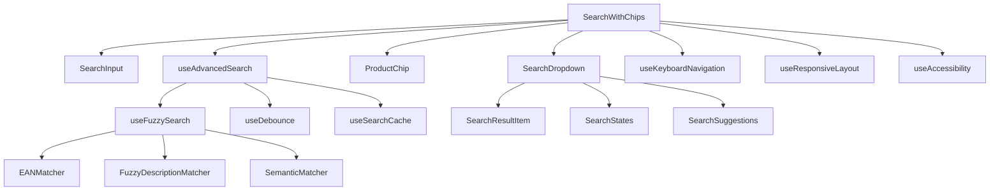

# 🔍 SearchWithChips - Arquitetura Avançada de Busca de Produtos

## 📋 Visão Geral do Projeto

Este documento detalha a arquitetura completa para um componente SearchWithChips robusto e avançado, implementando um sistema de busca inteligente de produtos com priorização por EAN, algoritmos fuzzy sofisticados, e interface totalmente acessível usando react-native-paper.

## 🎯 Objetivos Principais

- **Busca Inteligente**: Sistema hierárquico com EAN como prioridade absoluta
- **Algoritmos Fuzzy**: Correspondências parciais, correção de erros, análise fonética
- **Acessibilidade Completa**: WCAG 2.1 AA, navegação por teclado, screen readers
- **Performance Otimizada**: Debouncing, memoização, virtualização
- **UX Responsiva**: Adaptação dinâmica ao teclado, orientações múltiplas
- **Material Design 3**: Estrita aderência ao sistema de design do react-native-paper

## 🏗️ Arquitetura de Componentes



## 🧠 Sistema de Busca Inteligente

### Hierarquia de Priorização

1. **Nível 1 - EAN Exato** (Score: 10000)
   - Correspondência exata do código EAN
   - Prioridade máxima absoluta

2. **Nível 2 - EAN Parcial** (Score: 8000-9000)
   - StartsWith no código EAN
   - Pontuação baseada no comprimento da correspondência

3. **Nível 3 - Descrição Exata** (Score: 6000-7000)
   - Correspondência exata de palavras na descrição
   - Case-insensitive

4. **Nível 4 - Descrição Fuzzy** (Score: 1000-5000)
   - Algoritmo Levenshtein avançado
   - Análise de n-gramas
   - Correspondência fonética
   - Transposições e substituições

5. **Nível 5 - Correspondência Semântica** (Score: 100-999)
   - Análise de palavras-chave
   - Reconhecimento de radicais
   - Sinônimos contextuais

### Algoritmos Fuzzy Implementados

#### 🔤 Levenshtein Distance Otimizado
```typescript
interface LevenshteinConfig {
  insertionCost: number;    // Custo de inserção de caractere
  deletionCost: number;     // Custo de remoção de caractere
  substitutionCost: number; // Custo de substituição
  transpositionCost: number; // Custo de transposição (Damerau-Levenshtein)
  maxDistance: number;      // Distância máxima aceitável
}
```

#### 🔍 N-gram Analysis
- Bigrams e trigrams para análise de similaridade
- Jaccard similarity coefficient
- Weighted scoring baseado na posição

#### 📞 Análise Fonética
- Soundex brasileiro adaptado
- Metaphone para língua portuguesa
- Correção de erros fonéticos comuns

#### 🔄 Transposição e Substituição
- Detecção de caracteres trocados
- Substituições de teclado QWERTY comum
- Correção automática de acentuação

## 🎨 Interface e Experiência do Usuário

### Design System (react-native-paper)

#### Componentes Utilizados
- `TextInput` com mode="outlined"
- `Menu` para dropdown
- `Chip` para seleções
- `List.Item` para resultados
- `ActivityIndicator` para loading
- `Surface` para elevações

#### Tokens de Design
```typescript
interface DesignTokens {
  colors: MD3Colors;           // Paleta Material Design 3
  typography: MD3Typography;  // Escalas tipográficas
  elevation: MD3Elevation;    // Níveis de sombra
  spacing: MD3Spacing;        // Sistema de espaçamento
  animation: MD3Animation;    // Curvas e durações
}
```

### Estados Visuais

#### Loading States
- Skeleton loading para resultados
- Spinner no input durante busca
- Progressive disclosure

#### Empty States
- Mensagens contextuais
- Sugestões de busca
- Call-to-action claro

#### Error States
- Mensagens de erro específicas
- Retry mechanisms
- Feedback visual

### Responsividade Móvel

#### Adaptação de Teclado
```typescript
interface KeyboardAdaptation {
  dynamicViewportCalculation: boolean;
  autoScrollToFocus: boolean;
  contentReflow: boolean;
  touchTargetOptimization: boolean;
  orientationHandling: boolean;
}
```

#### Breakpoints e Orientações
- Portrait/Landscape adaptation
- Tablet/Phone optimizations
- Safe area handling
- Densidade de tela

## ⌨️ Acessibilidade e Navegação

### Navegação por Teclado

#### Suporte Completo
- Arrow Up/Down: Navegação entre resultados
- Enter: Seleção de item
- Escape: Fechar dropdown
- Tab: Navegação sequencial
- Space: Ativação alternativa

#### Focus Management
```typescript
interface FocusManagement {
  trapFocus: boolean;          // Trap focus no dropdown
  restoreFocus: boolean;       // Restaurar focus ao fechar
  skipLinks: boolean;          // Links de navegação rápida
  focusVisible: boolean;       // Indicadores visuais de focus
}
```

### ARIA e Screen Readers

#### Implementação Completa
- `aria-label` e `aria-labelledby`
- `aria-describedby` para instruções
- `aria-expanded` para estado do dropdown
- `aria-selected` para itens ativos
- `aria-live` para anúncios dinâmicos
- `role="combobox"` e `role="listbox"`

#### Suporte a Screen Readers
- Anúncios contextuais
- Contagem de resultados
- Estado da busca
- Instruções de navegação

## 🚀 Performance e Otimização

### Debouncing Inteligente
```typescript
interface DebounceConfig {
  searchDelay: number;        // 300ms padrão
  suggestionDelay: number;    // 150ms para sugestões
  cacheDelay: number;         // 100ms para cache hits
  adaptiveDelay: boolean;     // Ajuste baseado na velocidade de digitação
}
```

### Memoização e Cache

#### React Optimization
- `useMemo` para resultados computados
- `useCallback` para funções estáveis
- `React.memo` para componentes puros

#### Cache Strategy
```typescript
interface SearchCache {
  queryCache: Map<string, SearchResult[]>;
  resultCache: Map<string, Product>;
  maxCacheSize: number;
  ttl: number; // Time to live
}
```

### Virtualização
- Lista virtualizada para 1000+ resultados
- Windowing para performance
- Lazy loading de dados

## 🔧 Hooks Customizados

### useAdvancedSearch
```typescript
interface UseAdvancedSearchReturn {
  searchResults: SearchResult[];
  isLoading: boolean;
  error: string | null;
  searchQuery: string;
  setSearchQuery: (query: string) => void;
  clearSearch: () => void;
  suggestions: string[];
}
```

### useFuzzySearch
```typescript
interface UseFuzzySearchConfig {
  maxResults: number;
  fuzzyThreshold: number;
  enablePhonetic: boolean;
  enableNGram: boolean;
  enableSemantic: boolean;
}
```

### useKeyboardNavigation
```typescript
interface UseKeyboardNavigationReturn {
  activeIndex: number;
  handleKeyDown: (event: KeyboardEvent) => void;
  resetNavigation: () => void;
  navigateToIndex: (index: number) => void;
}
```

### useResponsiveLayout
```typescript
interface UseResponsiveLayoutReturn {
  keyboardHeight: number;
  viewportHeight: number;
  orientation: 'portrait' | 'landscape';
  dropdownPosition: 'above' | 'below';
  adjustedMargins: ViewStyle;
}
```

## 📱 Componentes Especializados

### SearchInput
```typescript
interface SearchInputProps {
  value: string;
  onChange: (value: string) => void;
  selectedProduct: Product | null;
  isLoading: boolean;
  error: string | null;
  placeholder: string;
  label: string;
  autoFocus?: boolean;
  disabled?: boolean;
  onFocus: () => void;
  onBlur: () => void;
  // Acessibilidade
  ariaLabel?: string;
  ariaDescribedBy?: string;
}
```

### SearchDropdown
```typescript
interface SearchDropdownProps {
  visible: boolean;
  products: SearchResult[];
  activeIndex: number;
  onProductSelect: (product: Product) => void;
  searchTerm: string;
  isLoading: boolean;
  error: string | null;
  maxHeight?: number;
  position: 'above' | 'below';
  width: number;
}
```

### ProductChip
```typescript
interface ProductChipProps {
  product: Product;
  onRemove: () => void;
  maxLength?: number;
  showPrice?: boolean;
  variant?: 'outlined' | 'filled';
}
```

### SearchResultItem
```typescript
interface SearchResultItemProps {
  product: Product;
  searchTerm: string;
  isActive: boolean;
  matchType: MatchType;
  score: number;
  onSelect: () => void;
  highlightMatch: boolean;
}
```

## 🔍 Algoritmo de Busca Detalhado

### Fluxo de Execução
```typescript
class AdvancedSearchEngine {
  search(query: string): SearchResult[] {
    // 1. Pré-processamento
    const normalizedQuery = this.normalizeQuery(query);
    
    // 2. Detecção de tipo (EAN vs Descrição)
    const queryType = this.detectQueryType(normalizedQuery);
    
    // 3. Busca hierárquica
    const results = this.hierarchicalSearch(normalizedQuery, queryType);
    
    // 4. Scoring e ordenação
    const scoredResults = this.scoreAndSort(results);
    
    // 5. Deduplicação e limitação
    return this.deduplicateAndLimit(scoredResults);
  }
}
```

### Scoring System
```typescript
interface ScoringWeights {
  exactMatch: number;      // 1.0
  startsWith: number;      // 0.8
  contains: number;        // 0.6
  fuzzyMatch: number;      // 0.4
  phoneticMatch: number;   // 0.3
  semanticMatch: number;   // 0.2
  positionBonus: number;   // 0.1 por posição inicial
  lengthPenalty: number;   // -0.05 por diferença de tamanho
}
```

## 🧪 Estratégia de Testes

### Unit Tests
- Algoritmos de busca fuzzy
- Hooks customizados
- Utilities e helpers
- Performance benchmarks

### Integration Tests
- Fluxo completo de busca
- Navegação por teclado
- Estados de loading/error
- Responsividade

### Accessibility Tests
- Screen reader compatibility
- Keyboard navigation
- ARIA compliance
- Color contrast

### Performance Tests
- Search algorithm benchmarks
- Memory usage profiling
- Render performance
- Cache effectiveness

## 📊 Métricas e Monitoramento

### Performance Metrics
- Search latency (< 100ms)
- Memory usage (< 50MB)
- Cache hit rate (> 80%)
- Bundle size impact

### UX Metrics
- Search success rate
- Average time to selection
- Error rate
- Accessibility compliance score

## 🔮 Funcionalidades Futuras

### Fase 2 - Enhancements
- Machine learning para relevância
- Histórico de buscas
- Busca por voz
- Offline search capability

### Fase 3 - Advanced Features
- Busca por imagem/câmera
- Filtros avançados
- Categorização automática
- Analytics de busca

## 🛠️ Stack Tecnológico

### Dependencies
```json
{
  "react": "^18.x",
  "react-native": "^0.72.x",
  "react-native-paper": "^5.x",
  "typescript": "^5.x"
}
```

### Development Dependencies
```json
{
  "@testing-library/react-native": "^12.x",
  "@types/react": "^18.x",
  "jest": "^29.x",
  "eslint": "^8.x"
}
```

## 📝 Implementação Timeline

### Sprint 1 (1 semana)
- [ ] Setup base do projeto
- [ ] Hooks fundamentais (useDebounce, useAdvancedSearch)
- [ ] Componente SearchInput básico

### Sprint 2 (1 semana)
- [ ] Algoritmo de busca hierárquico
- [ ] SearchDropdown com estados
- [ ] Navegação por teclado básica

### Sprint 3 (1 semana)
- [ ] Algoritmos fuzzy (Levenshtein, N-gram)
- [ ] ProductChip e seleção
- [ ] Acessibilidade ARIA

### Sprint 4 (1 semana)
- [ ] Responsividade móvel
- [ ] Adaptação de teclado
- [ ] Performance optimization

### Sprint 5 (1 semana)
- [ ] Testes completos
- [ ] Documentação
- [ ] Polimento e bug fixes

## ✅ Critérios de Aceitação

### Funcionalidade Core
- ✅ Busca por EAN com prioridade absoluta
- ✅ Busca fuzzy em descrições
- ✅ Seleção única com chip
- ✅ Performance < 100ms para busca

### Acessibilidade
- ✅ Navegação completa por teclado
- ✅ Suporte a screen readers
- ✅ WCAG 2.1 AA compliance
- ✅ Focus management robusto

### UX/UI
- ✅ Design Material 3 puro
- ✅ Responsividade móvel
- ✅ Adaptação de teclado
- ✅ Estados visuais claros

### Performance
- ✅ Debouncing otimizado
- ✅ Memoização eficiente
- ✅ Cache inteligente
- ✅ Bundle size otimizado

---

**Desenvolvido com foco em qualidade, performance e acessibilidade para React Native Paper**