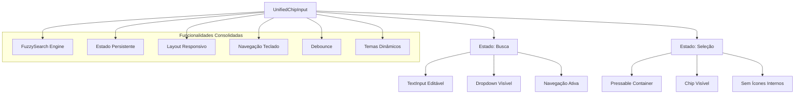
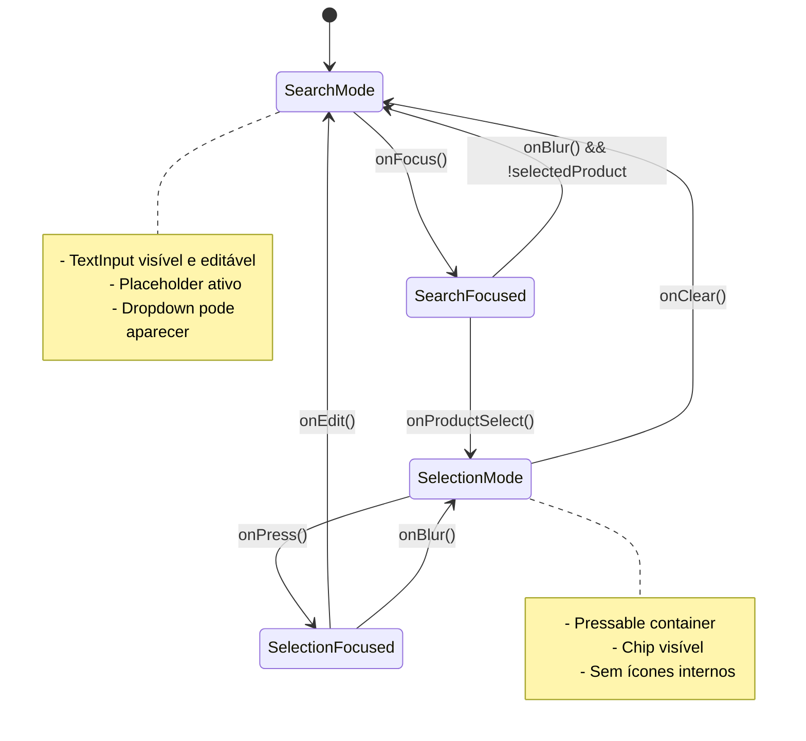

# Plano de Arquitetura: Componente de Chip Unificado

## Visão Geral

Este documento apresenta o plano arquitetural detalhado para refatorar o sistema atual de componentes de busca com chips em um único componente unificado que consolida todas as funcionalidades existentes.

## Análise da Arquitetura Atual

### Componentes Existentes Analisados

1. **[`src/App.tsx`](src/App.tsx:1)** - Aplicação principal demonstrando o uso dos componentes
2. **[`src/types/chipStates.ts`](src/types/chipStates.ts:1)** - Sistema de tipos para estados de chip
3. **[`src/styles/chipThemes.ts`](src/styles/chipThemes.ts:1)** - Temas e estilos baseados em estado
4. **[`src/utils/fuzzySearch.ts`](src/utils/fuzzySearch.ts:1)** - Motor de busca fuzzy avançado
5. **[`src/hooks/useChipPersistentState.ts`](src/hooks/useChipPersistentState.ts:1)** - Gestão de estado persistente
6. **[`src/hooks/useAdvancedSearch.ts`](src/hooks/useAdvancedSearch.ts:1)** - Hook de busca avançada
7. **[`src/hooks/useResponsiveLayout.ts`](src/hooks/useResponsiveLayout.ts:1)** - Layout responsivo
8. **[`src/hooks/useKeyboardNavigation.ts`](src/hooks/useKeyboardNavigation.ts:1)** - Navegação por teclado
9. **[`src/hooks/useDebounce.ts`](src/hooks/useDebounce.ts:1)** - Debounce para performance
10. **[`src/components/SearchWithChips.tsx`](src/components/SearchWithChips.tsx:1)** - Componente principal atual
11. **[`src/components/SingleChipSearch.tsx`](src/components/SingleChipSearch.tsx:1)** - Versão simplificada
12. **[`src/components/ProductChip.tsx`](src/components/ProductChip.tsx:1)** - Chip de produto individual

### Funcionalidades Identificadas

#### Sistema de Estados de Chip
- **4 Estados**: `none`, `selected`, `active`, `persistent`
- **Transições Validadas**: Sistema robusto de transições de estado
- **Acessibilidade**: Estados ARIA completos
- **Debugging**: Histórico de transições e logs

#### Motor de Busca Avançado
- **Busca Fuzzy**: Algoritmos Levenshtein e N-gram
- **Matching Inteligente**: EAN exato, parcial, descrição fuzzy e semântica
- **Cache**: Sistema de cache para performance
- **Highlight**: Ranges de destaque nos resultados

#### Interface e UX
- **Layout Responsivo**: Adaptação para tablets e diferentes orientações
- **Navegação por Teclado**: Suporte completo para setas, Enter, Escape
- **Debounce**: Otimização de performance em buscas
- **Posicionamento Inteligente**: Dropdown adaptativo baseado no espaço disponível

#### Temas e Estilos
- **Estilos Dinâmicos**: Baseados no estado atual do chip
- **Variantes**: Suporte para `outlined` e `flat`
- **Animações**: Transições suaves entre estados
- **Z-Index**: Gestão adequada de camadas

## Arquitetura do Componente Unificado

### Conceito Central



### Interface do Componente

```typescript
interface UnifiedChipInputProps {
  // Dados
  products: Product[];
  selectedProduct?: Product | null;
  onSelectionChange: (product: Product | null) => void;
  
  // Configuração de Busca
  maxResults?: number;
  debounceMs?: number;
  fuzzyThreshold?: number;
  searchConfig?: FuzzySearchConfig;
  
  // Aparência
  label?: string;
  placeholder?: string;
  variant?: 'outlined' | 'flat';
  mode?: 'search' | 'selection' | 'auto';
  
  // Comportamento
  disabled?: boolean;
  autoFocus?: boolean;
  allowClear?: boolean;
  enablePersistence?: boolean;
  
  // Layout
  responsive?: boolean;
  keyboardNavigation?: boolean;
  
  // Estados e Callbacks
  error?: string;
  loading?: boolean;
  onFocus?: () => void;
  onBlur?: () => void;
  onModeChange?: (mode: 'search' | 'selection') => void;
  
  // Acessibilidade
  ariaLabel?: string;
  ariaDescribedBy?: string;
  testID?: string;
}
```

### Estados do Componente

#### Estado Principal
```typescript
type ComponentMode = 'search' | 'selection';

interface UnifiedChipState {
  // Modo atual
  mode: ComponentMode;
  
  // Estado de busca
  searchQuery: string;
  searchResults: SearchResult[];
  isSearching: boolean;
  showDropdown: boolean;
  
  // Estado de seleção
  selectedProduct: Product | null;
  chipState: ChipState;
  
  // Estado da interface
  isFocused: boolean;
  isInputFocused: boolean;
  keyboardActiveIndex: number;
  
  // Layout
  inputPosition: Position;
  dropdownPosition: DropdownPosition;
}
```

### Lógica de Transição de Estados



## Estrutura de Arquivos Proposta

### Nova Estrutura
```
src/
├── components/
│   ├── UnifiedChipInput/
│   │   ├── index.ts
│   │   ├── UnifiedChipInput.tsx          # Componente principal
│   │   ├── UnifiedChipInput.types.ts     # Tipos específicos
│   │   ├── UnifiedChipInput.styles.ts    # Estilos consolidados
