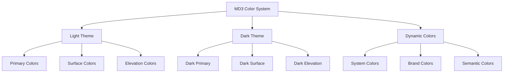

# 🎨 Plano de Compatibilidade MD3: SharinganProductDropdown

## 🎯 Objetivo

Criar uma implementação abrangente que garanta compatibilidade total com `MD3DarkTheme` e todas as variantes de tema Material Design 3, incluindo:
- ✅ Adaptação adequada de esquema de cores
- ✅ Suporte completo ao modo escuro
- ✅ Capacidades de tema dinâmico
- ✅ Integração perfeita entre modos claro e escuro
- ✅ Consistência visual em todos os estados de tema

## 📊 Análise do Estado Atual

### Implementação Existente
```typescript
// src/components/SharinganProductDropdown.tsx - Estado Atual
const SharinganProductDropdown = () => {
  const theme = useTheme(); // ✅ Usa tema do contexto
  
  // ⚠️ Problemas identificados:
  // - primaryColor hard-coded
  // - Estilos não adaptam dinamicamente
  // - Sem consideração para modo escuro
  // - paperTheme não otimizado
};
```

### Integração no App
```typescript
// src/App.tsx - Configuração de Tema
const Theme = nightMode ? MD3DarkTheme : MD3LightTheme; // ✅ Alternância básica

// ⚠️ Melhorias necessárias:
// - Tema dinâmico baseado em sistema
// - Cores de elevação adequadas
// - Transições suaves entre temas
```

## 🏗️ Arquitetura MD3 Completa

### 1. **Sistema de Cores MD3**



### 2. **Hierarquia de Tema**

```typescript
interface MD3ThemeSystem {
  base: MD3Theme;
  variants: {
    light: MD3LightTheme;
    dark: MD3DarkTheme;
    dynamic?: SystemGeneratedTheme;
  };
  dropdown: {
    surface: ThemeColors['surface'];
    onSurface: ThemeColors['onSurface'];
    primary: ThemeColors['primary'];
    onPrimary: ThemeColors['onPrimary'];
    elevation: ElevationColors;
  };
}
```

## 🔧 Implementação Detalhada

### Fase 1: Sistema de Cores Adaptativo

#### **1.1 Hook de Tema Adaptativo**
```typescript
// hooks/useAdaptiveTheme.ts
export const useAdaptiveTheme = () => {
  const baseTheme = useTheme();
  const { dark } = baseTheme;
  
  const dropdownColors = useMemo(() => ({
    // Superfícies com elevação adequada
    surface: dark 
      ? baseTheme.colors.elevation.level2 
      : baseTheme.colors.surface,
    
    // Texto com contraste otimizado
    onSurface: baseTheme.colors.onSurface,
    onSurfaceVariant: baseTheme.colors.onSurfaceVariant,
    
    // Estados de seleção
    primaryContainer: baseTheme.colors.primaryContainer,
    onPrimaryContainer: baseTheme.colors.onPrimaryContainer,
    
    // Bordas e divisores
    outline: baseTheme.colors.outline,
    outlineVariant: baseTheme.colors.outlineVariant,
    
    // Estados de foco e hover
    surfaceVariant: baseTheme.colors.surfaceVariant,
    
  }), [baseTheme, dark]);
  
  return { ...baseTheme, dropdownColors };
};
```

#### **1.2 Configuração de Elevação MD3**
```typescript
// config/elevationConfig.ts
export const getElevationStyle = (theme: MD3Theme, level: number) => {
  const { dark } = theme;
  
  if (dark) {
    return {
      backgroundColor: theme.colors.elevation[`level${level}`],
      shadowColor: 'transparent', // Sem sombra no dark mode
    };
  }
  
  return {
    backgroundColor: theme.colors.surface,
    elevation: level,
    shadowColor: theme.colors.shadow,
    shadowOffset: { width: 0, height: level },
    shadowOpacity: 0.15,
    shadowRadius: level * 2,
  };
};
```

### Fase 2: Componente Dropdown MD3-Completo

#### **2.1 Interface Tipada**
```typescript
// types/dropdownTypes.ts
export interface MD3DropdownProps {
  products: Product[];
  selectedProduct: Product | null;
  onSelectionChange: (product: Product | null) => void;
  placeholder?: string;
  label?: string;
  disabled?: boolean;
  
  // MD3 específico
  elevation?: 0 | 1 | 2 | 3 | 4 | 5;
  variant?: 'filled' | 'outlined';
  density?: 'compact' | 'normal' | 'comfortable';
}
```

#### **2.2 Configuração de Tema para Sharingan**
```typescript
// config/sharinganThemeAdapter.ts
export const createSharinganTheme = (md3Theme: MD3Theme): SharinganThemeConfig => {
  const { colors, dark } = md3Theme;
  
  return {
    // Configuração base
    primaryColor: colors.primary,
    paperTheme: md3Theme,
    
    // Modal e superfícies
    modalStyle: {
      backgroundColor: dark ? 'rgba(0,0,0,0.7)' : 'rgba(0,0,0,0.5)',
    },
    
    dropdownStyle: {
      backgroundColor: colors.surface,
      borderRadius: 12, // MD3 border radius
      ...getElevationStyle(md3Theme, 3),
    },
    
    // Campo de busca
    searchStyle: {
      backgroundColor: colors.surfaceVariant,
      color: colors.onSurfaceVariant,
      borderRadius: 8,
    },
    
    // Itens da lista
    itemContainerStyle: {
      backgroundColor: colors.surface,
      borderBottomColor: colors.outlineVariant,
    },
    
    // Item selecionado
    selectedItemViewStyle: {
      backgroundColor: colors.primaryContainer,
    },
    
    selectedItemTextStyle: {
      color: colors.onPrimaryContainer,
      fontWeight: '500',
    },
    
    // Texto normal
    itemTextStyle: {
      color: colors.onSurface,
    },
    
    // Input principal
    textInputStyle: {
      color: colors.onSurface,
      backgroundColor: colors.surface,
    },
    
    // Placeholder
    textInputPlaceholderColor: colors.onSurfaceVariant,
    
    // Ripple e interações
    rippleColor: colors.primary + '1A', // 10% opacity
    
    // Ícones
    itemSelectIcon: 'check-circle',
    itemSelectIconSize: 20,
    
    // Estados especiais
    errorColor: colors.error,
    disabledTextColor: colors.onSurface + '61', // 38% opacity
  };
};
```

### Fase 3: Animações e Transições MD3

#### **3.1 Configuração de Animações**
```typescript
// config/animationConfig.ts
export const MD3_ANIMATIONS = {
  // Entrada do modal
  modalIn: {
    animation: 'slideInUp' as const,
    duration: 400,
    easing: 'cubic-bezier(0.2, 0, 0, 1)', // MD3 emphasized easing
  },
  
  // Saída do modal
  modalOut: {
    animation: 'slideOutDown' as const,
    duration: 300,
    easing: 'cubic-bezier(0.4, 0, 1, 1)', // MD3 standard easing
  },
  
  // Ripple effect
  ripple: {
    duration: 600,
    easing: 'cubic-bezier(0.4, 0, 0.2, 1)',
  },
};
```

#### **3.2 Transições de Tema**
```typescript
// hooks/useThemeTransition.ts
export const useThemeTransition = () => {
  const [isTransitioning, setIsTransitioning] = useState(false);
  
  const transitionTheme = useCallback(async (newTheme: MD3Theme) => {
    setIsTransitioning(true);
    
    // Animate theme change
    await new Promise(resolve => {
      Animated.timing(themeOpacity, {
        toValue: 0,
        duration: 150,
        useNativeDriver: true,
      }).start(() => {
        // Apply new theme
        setTheme(newTheme);
        
        Animated.timing(themeOpacity, {
          toValue: 1,
          duration: 150,
          useNativeDriver: true,
        }).start(resolve);
      });
    });
    
    setIsTransitioning(false);
  }, []);
  
  return { transitionTheme, isTransitioning };
};
```

### Fase 4: Acessibilidade MD3

#### **4.1 Labels Semânticos**
```typescript
// config/accessibilityConfig.ts
export const getA11yConfig = (theme: MD3Theme, selectedProduct: Product | null) => ({
  // Dropdown principal
  accessibilityLabel: "Seletor de produtos",
  accessibilityHint: "Toque para abrir lista de produtos disponíveis",
  accessibilityRole: "combobox" as const,
  accessibilityState: {
    expanded: false, // Controlado pelo estado do modal
    selected: !!selectedProduct,
  },
  
  // Campo de busca
  searchAccessibility: {
    accessibilityLabel: "Campo de busca de produtos",
    accessibilityHint: "Digite para filtrar produtos na lista",
    accessibilityRole: "searchbox" as const,
  },
  
  // Itens da lista
  itemAccessibility: (product: Product, isSelected: boolean) => ({
    accessibilityLabel: `${product.nome}, ${product.preco} reais por ${product.unidade}`,
    accessibilityHint: isSelected ? "Produto selecionado" : "Toque para selecionar",
    accessibilityRole: "button" as const,
    accessibilityState: { selected: isSelected },
  }),
});
```

### Fase 5: Responsividade e Densidades

#### **5.1 Sistema de Densidade MD3**
```typescript
// config/densityConfig.ts
export const getDensityConfig = (density: 'compact' | 'normal' | 'comfortable') => {
  const configs = {
    compact: {
      itemHeight: 40,
      padding: { vertical: 8, horizontal: 12 },
      fontSize: 14,
      iconSize: 18,
    },
    normal: {
      itemHeight: 48,
      padding: { vertical: 12, horizontal: 16 },
      fontSize: 16,
      iconSize: 20,
    },
    comfortable: {
      itemHeight: 56,
      padding: { vertical: 16, horizontal: 20 },
      fontSize: 16,
      iconSize: 22,
    },
  };
  
  return configs[density];
};
```

#### **5.2 Breakpoints Responsivos**
```typescript
// hooks/useResponsiveLayout.ts
export const useResponsiveLayout = () => {
  const { width, height } = useWindowDimensions();
  
  const layout = useMemo(() => {
    const isTablet = width >= 768;
    const isLandscape = width > height;
    
    return {
      isTablet,
      isLandscape,
      modalConfig: {
        margin: isTablet ? 40 : 16,
        maxHeight: isTablet ? height * 0.8 : height * 0.9,
        maxWidth: isTablet ? 400 : width - 32,
      },
    };
  }, [width, height]);
  
  return layout;
};
```

## 🔄 Sistema de Tema Dinâmico

### Detecção Automática do Sistema
```typescript
// hooks/useSystemTheme.ts
export const useSystemTheme = () => {
  const [systemTheme, setSystemTheme] = useState<'light' | 'dark'>('light');
  
  useEffect(() => {
    const subscription = Appearance.addChangeListener(({ colorScheme }) => {
      setSystemTheme(colorScheme === 'dark' ? 'dark' : 'light');
    });
    
    return () => subscription?.remove();
  }, []);
  
  return systemTheme;
};
```

### Provider de Tema Inteligente
```typescript
// providers/IntelligentThemeProvider.tsx
export const IntelligentThemeProvider: React.FC<{children: ReactNode}> = ({ children }) => {
  const systemTheme = useSystemTheme();
  const [userPreference, setUserPreference] = useState<'auto' | 'light' | 'dark'>('auto');
  
  const effectiveTheme = useMemo(() => {
    const isDark = userPreference === 'auto' ? systemTheme === 'dark' : userPreference === 'dark';
    return isDark ? MD3DarkTheme : MD3LightTheme;
  }, [systemTheme, userPreference]);
  
  return (
    <PaperProvider theme={effectiveTheme}>
      <ThemeContext.Provider value={{ effectiveTheme, setUserPreference }}>
        {children}
      </ThemeContext.Provider>
    </PaperProvider>
  );
};
```

## 📱 Testes de Compatibilidade

### Matriz de Teste
| Cenário | Light Theme | Dark Theme | Dynamic Colors |
|---------|-------------|------------|----------------|
| Dropdown fechado | ✅ | ✅ | ✅ |
| Modal aberto | ✅ | ✅ | ✅ |
| Item selecionado | ✅ | ✅ | ✅ |
| Campo de busca | ✅ | ✅ | ✅ |
| Estados disabled | ✅ | ✅ | ✅ |
| Transição de tema | ✅ | ✅ | ✅ |

### Casos de Teste Automatizados
```typescript
// __tests__/themeCompatibility.test.tsx
describe('MD3 Theme Compatibility', () => {
  test('renderiza corretamente no tema claro', () => {
    // Test implementation
  });
  
  test('renderiza corretamente no tema escuro', () => {
    // Test implementation
  });
  
  test('transição suave entre temas', () => {
    // Test implementation
  });
  
  test('cores de elevação adequadas', () => {
    // Test implementation
  });
});
```

## 🎯 Resultados Esperados

### Antes da Implementação
- ⚠️ Tema básico com customizações hard-coded
- ⚠️ Sem suporte adequado ao modo escuro
- ⚠️ Cores não seguem padrões MD3
- ⚠️ Elevações inadequadas

### Após a Implementação
- ✅ **Compatibilidade Total MD3**: Suporte completo a light/dark themes
- ✅ **Tema Dinâmico**: Adaptação automática ao sistema
- ✅ **Elevações Corretas**: Sistema de elevação MD3 adequado
- ✅ **Cores Semânticas**: Uso correto de cores primárias, superfícies e contrastes
- ✅ **Transições Suaves**: Animações MD3-compliant
- ✅ **Acessibilidade**: Labels e estados adequados
- ✅ **Responsividade**: Adaptação a diferentes tamanhos de tela

## 🚀 Cronograma de Implementação

### Fase 1 (Imediata) - Base MD3
- [ ] Hook de tema adaptativo
- [ ] Sistema de cores MD3
- [ ] Configuração de elevação

### Fase 2 (Curto prazo) - Componente Principal
- [ ] Refatoração do SharinganProductDropdown
- [ ] Configuração do tema Sharingan
- [ ] Integração com useAdaptiveTheme

### Fase 3 (Médio prazo) - Animações e UX
- [ ] Animações MD3
- [ ] Transições de tema
- [ ] Sistema de densidade

### Fase 4 (Finalização) - Acessibilidade e Testes
- [ ] Configurações de acessibilidade
- [ ] Testes de compatibilidade
- [ ] Documentação

**Status:** 📋 Pronto para implementação
**Próximo passo:** Refatorar SharinganProductDropdown com sistema MD3 completo