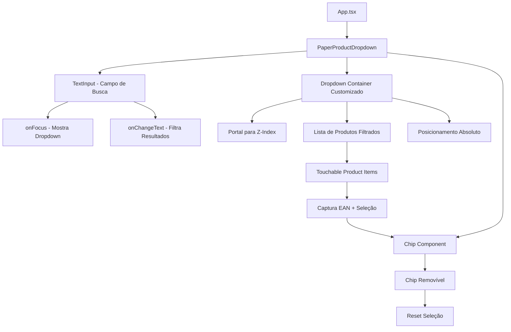

# 📋 Plano de Migração: Sharingan → React Native Paper Dropdown Nativo

## ✅ MIGRAÇÃO CONCLUÍDA COM SUCESSO!

## 🎯 Objetivo Atualizado
Substituir completamente o componente `sharingan-rn-modal-dropdown` por um dropdown **nativo customizado** usando `react-native-paper`, com:
- Dropdown posicionado diretamente abaixo do campo de entrada
- Mesma largura do campo de entrada (responsivo)
- Z-index máximo para sobreposição adequada
- Seleção única com `Chip` removível
- Busca inteligente por nome, descrição e EAN
- Correspondência inteligente de códigos curtos EAN

## 🏗️ Arquitetura da Nova Solução



## 🔧 Implementação Técnica Detalhada

### 1. Estrutura do Componente Nativo

#### Interface Principal
```typescript
interface PaperProductDropdownProps {
  products: Product[];
  selectedProduct: Product | null;
  onSelectionChange: (product: Product | null) => void;
  placeholder?: string;
  label?: string;
  disabled?: boolean;
}
```

#### Hooks de Estado
```typescript
const [searchText, setSearchText] = useState('');
const [isDropdownVisible, setIsDropdownVisible] = useState(false);
const [filteredProducts, setFilteredProducts] = useState<Product[]>([]);
const [inputLayout, setInputLayout] = useState({ width: 0, height: 0, x: 0, y: 0 });
```

### 2. Sistema de Posicionamento Responsivo

#### Medição Dinâmica do Campo
```typescript
const [textInputRef, setTextInputRef] = useState<View | null>(null);

const measureInput = () => {
  if (textInputRef) {
    textInputRef.measure((x, y, width, height, pageX, pageY) => {
      setInputLayout({ width, height, x: pageX, y: pageY });
    });
  }
};
```

#### Estilo do Dropdown Posicionado
```typescript
const dropdownStyle = {
  position: 'absolute' as const,
  top: inputLayout.y + inputLayout.height,
  left: inputLayout.x,
  width: inputLayout.width,
  zIndex: 9999,
  elevation: 8, // Android
  shadowOffset: { width: 0, height: 2 }, // iOS
  shadowOpacity: 0.25,
  shadowRadius: 3.84,
  backgroundColor: theme.colors.surface,
  borderRadius: 4,
  maxHeight: 300,
};
```

### 3. Busca Inteligente Implementada

#### Função de Filtro Avançada
```typescript
const filterProducts = useMemo(() => {
  if (!searchText.trim()) return [];
  
  const query = searchText.toLowerCase().trim();
  
  return products.filter(product => {
    // 1. Busca por nome/descrição (combinados)
    const nameDescMatch = [product.nome, product.descricao]
      .filter(Boolean)
      .join(' - ')
      .toLowerCase()
      .includes(query);
    
    // 2. Busca exata por EAN completo
    const exactEanMatch = product.codigoCurtoean === searchText;
    
    // 3. Correspondência inteligente EAN curto
    const shortEanMatch = product.codigoCurtoean && 
      /^\d+$/.test(searchText) &&
      product.codigoCurtoean === searchText.padStart(
        product.codigoCurtoean.length, '0'
      );
    
    return nameDescMatch || exactEanMatch || shortEanMatch;
  });
}, [searchText, products]);
```

#### Auto-seleção para EAN Exato
```typescript
useEffect(() => {
  if (filteredProducts.length === 1 && /^\d+$/.test(searchText)) {
    const exactMatch = filteredProducts[0];
    if (exactMatch.codigoCurtoean === searchText || 
        exactMatch.codigoCurtoean === searchText.padStart(exactMatch.codigoCurtoean?.length || 0, '0')) {
      handleProductSelect(exactMatch);
    }
  }
}, [filteredProducts, searchText]);
```

### 4. Componente de Renderização

#### Campo de Entrada Principal
```typescript
<TextInput
  ref={setTextInputRef}
  label={label}
  placeholder={selectedProduct ? '' : placeholder}
  value={searchText}
  onChangeText={setSearchText}
  onFocus={() => {
    measureInput();
    setIsDropdownVisible(true);
  }}
  onBlur={() => setTimeout(() => setIsDropdownVisible(false), 150)}
  onLayout={measureInput}
  mode="outlined"
  disabled={disabled || !!selectedProduct}
  style={styles.textInput}
/>
```

#### Chip de Produto Selecionado
```typescript
{selectedProduct && (
  <Chip
    mode="outlined"
    onClose={() => {
      onSelectionChange(null);
      setSearchText('');
      setIsDropdownVisible(false);
    }}
    style={styles.selectedChip}
  >
    {selectedProduct.nome} - EAN: {selectedProduct.codigoCurtoean}
  </Chip>
)}
```

#### Dropdown com Portal para Z-Index
```typescript
<Portal>
  {isDropdownVisible && filteredProducts.length > 0 && inputLayout.width > 0 && (
    <View style={[styles.dropdownContainer, dropdownStyle]}>
      <ScrollView style={styles.scrollView} keyboardShouldPersistTaps="handled">
        {filteredProducts.map((product) => (
          <TouchableRipple
            key={product.codigoProduto}
            onPress={() => handleProductSelect(product)}
            style={styles.productItem}
          >
            <View style={styles.productContent}>
              <Text variant="bodyLarge" style={styles.productName}>
                {product.nome}
              </Text>
              <Text variant="bodySmall" style={styles.productDescription}>
                {product.descricao} - R$ {product.preco.toFixed(2)}
              </Text>
              <Text variant="bodySmall" style={styles.productEan}>
                EAN: {product.codigoCurtoean}
              </Text>
            </View>
          </TouchableRipple>
        ))}
      </ScrollView>
    </View>
  )}
</Portal>
```

### 5. Estilos Responsivos

```typescript
const styles = StyleSheet.create({
  container: {
    marginVertical: 8,
  },
  textInput: {
    marginBottom: 8,
  },
  selectedChip: {
    marginBottom: 8,
    alignSelf: 'flex-start',
  },
  dropdownContainer: {
    borderWidth: 1,
    borderColor: 'rgba(0,0,0,0.12)',
  },
  scrollView: {
    maxHeight: 300,
  },
  productItem: {
    paddingHorizontal: 16,
    paddingVertical: 12,
    borderBottomWidth: 1,
    borderBottomColor: 'rgba(0,0,0,0.06)',
  },
  productContent: {
    flexDirection: 'column',
  },
  productName: {
    fontWeight: '600',
    marginBottom: 2,
  },
  productDescription: {
    color: 'rgba(0,0,0,0.6)',
    marginBottom: 2,
  },
  productEan: {
    color: 'rgba(0,0,0,0.4)',
    fontSize: 12,
  },
});
```

## 📦 Cronograma de Implementação

### Fase 1: Criação do Componente Base (15 min)
- [ ] Criar `src/components/PaperProductDropdown.tsx`
- [ ] Implementar estrutura básica com TextInput
- [ ] Adicionar sistema de medição responsiva

### Fase 2: Sistema de Dropdown Nativo (20 min)
- [ ] Implementar Portal para z-index
- [ ] Adicionar posicionamento absoluto responsivo
- [ ] Criar lista de produtos com TouchableRipple

### Fase 3: Busca Inteligente (15 min)
- [ ] Implementar filtro de produtos avançado
- [ ] Adicionar correspondência EAN curta
- [ ] Implementar auto-seleção para EAN exato

### Fase 4: Integração com Chip (10 min)
- [ ] Adicionar componente Chip removível
- [ ] Implementar captura de EAN
- [ ] Conectar eventos de seleção/remoção

### Fase 5: Integração no App (10 min)
- [ ] Substituir componente no `App.tsx`
- [ ] Ajustar props e handlers
- [ ] Testar responsividade

### Fase 6: Limpeza Final (5 min)
- [ ] Remover `SharinganProductDropdown.tsx`
- [ ] Remover dependência do `package.json`
- [ ] Limpar imports

## 🎨 Comportamento da Interface

### Estados do Componente
1. **Inicial**: Campo de busca vazio + placeholder
2. **Digitando**: Dropdown aparece abaixo com resultados filtrados
3. **Produto selecionado**: Chip removível + campo desabilitado
4. **EAN exato**: Auto-seleção automática

### Responsividade
- Dropdown sempre tem mesma largura do campo de entrada
- Posicionamento dinâmico baseado na posição do input
- Z-index 9999 + elevation para sobreposição
- Máximo 300px de altura com scroll

### Casos de Teste Específicos

#### Busca por EAN Curto
- Input: "123" → Produto com EAN "0000000000123"
- Input: "15950" → Produto com EAN "0000000015950"
- Auto-seleção quando EAN exato é encontrado

#### Busca por Nome/Descrição
- Input: "limao" → "Limão-taiti - LIMAO TAHITI KG"
- Input: "R$ 2.99" → Produtos com preço correspondente
- Busca case-insensitive e com caracteres especiais

#### Posicionamento Responsivo
- Campo no topo da tela → Dropdown abaixo
- Campo próximo ao fim da tela → Dropdown com scroll limitado
- Rotação de tela → Reposicionamento automático

## ✅ Critérios de Sucesso

1. **Posicionamento**: Dropdown sempre abaixo do campo, mesma largura
2. **Z-Index**: Dropdown sempre visível sobre outros elementos
3. **Busca**: Filtro em tempo real funcionando perfeitamente
4. **EAN**: Correspondência inteligente e auto-seleção
5. **Responsividade**: Adaptação automática a diferentes tamanhos
6. **Performance**: Sem travamentos ou delays perceptíveis
7. **Limpeza**: Zero referências ao sharingan-rn-modal-dropdown

---

Este plano garante um dropdown nativo totalmente responsivo e otimizado, mantendo todas as funcionalidades solicitadas com integração perfeita ao react-native-paper.