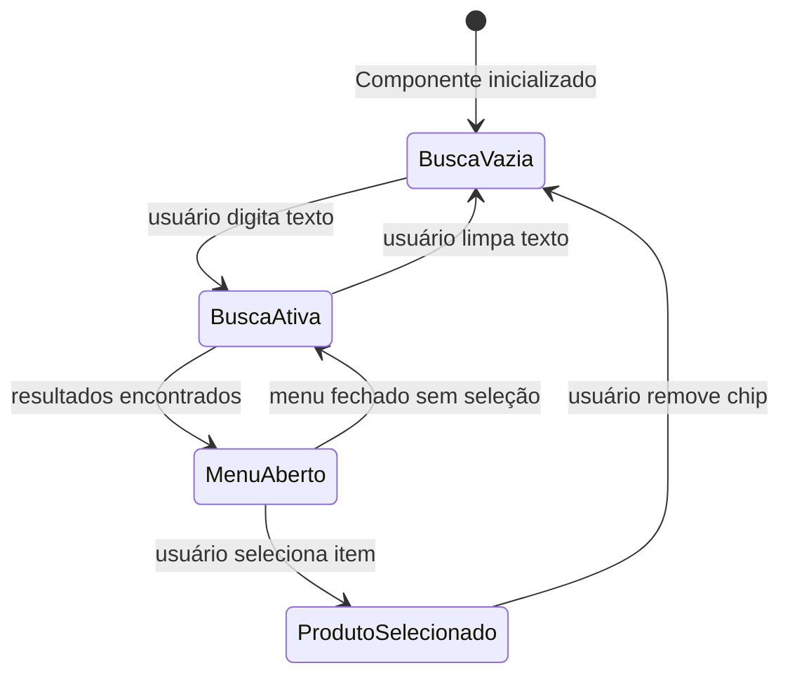
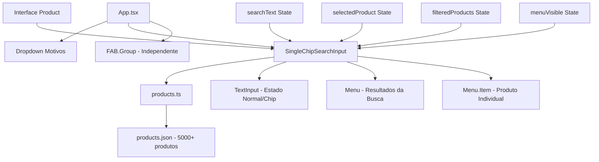

# 📋 Plano de Implementação: SingleChipSearchInput

## 🎯 Objetivo

Criar um componente `SingleChipSearchInput` que permite buscar e selecionar um único produto do arquivo `products.json` usando exclusivamente a biblioteca `react-native-paper`. O produto selecionado será exibido como um "chip" através da adaptação do próprio `TextInput`.

## 📊 Contexto do Projeto

- **Localização**: Projeto React Native com react-native-paper
- **Integração**: Adicionar junto ao Dropdown de motivos existente no `App.tsx`
- **Dados**: Utilizar produtos do arquivo `src/data/products.json` (5000+ produtos)
- **FAB.Group**: Permanece independente por enquanto

## 🏗️ Arquitetura do Componente

### Estados Principais
```typescript
const [searchText, setSearchText] = useState<string>('');
const [selectedProduct, setSelectedProduct] = useState<Product | null>(null);
const [filteredProducts, setFilteredProducts] = useState<Product[]>([]);
const [menuVisible, setMenuVisible] = useState<boolean>(false);
```

### Fluxo de Estados


## 🔍 Funcionamento do "Chip"

### Como o TextInput se Transforma em Chip

1. **Estado Normal (Busca)**:
   - `editable={true}`
   - `value={searchText}`
   - `placeholder="Digite descrição ou código"`
   - Ícone: "close-circle" para limpar busca (se houver texto)

2. **Estado Chip (Produto Selecionado)**:
   - `editable={false}` - Impede edição
   - `value={selectedProduct.descricao}` - Mostra produto selecionado
   - `placeholder=""` - Remove placeholder
   - Ícone: "close-circle" para remover produto selecionado
   - Estilo visual: Totalmente gerenciado pelo tema react-native-paper

### Transições Suaves
- Uso de `LayoutAnimation.configureNext()` para animações entre estados
- Controle de foco automático após remoção do chip

## 📁 Estrutura de Arquivos

### Novos Arquivos
```
src/
├── data/
│   └── products.ts          # Interface Product + export PRODUCTS
└── components/
    └── SingleChipSearchInput.tsx  # Componente principal
```

### Arquivos Modificados
```
src/
├── App.tsx                  # Integração do novo componente
└── docs/
    └── single-chip-search-input-plan.md  # Este documento
```

## 💾 Estrutura de Dados

### Interface Product
```typescript
export interface Product {
  codigoProduto: string;
  codigoCurtoean: string | null;
  descricao: string;
  unidade: string;
  preco: number;
  nome: string;
  // Outros campos opcionais do JSON...
}
```

### Campos de Busca
- **Descrição**: Busca case-insensitive na descrição do produto
- **Código Curto EAN**: Busca exata no codigoCurtoean (quando disponível)
- **Limites**: Busca ativa a partir de 1 caractere, máximo 10 resultados

## 🎨 Interface e Props

### Props do Componente
```typescript
export interface SingleChipSearchInputProps {
  products: Product[];
  label: string;
  placeholder?: string;
  onSelectionChange?: (selectedProduct: Product | null) => void;
  initialSelectedProduct?: Product | null;
}
```

### Exemplo de Uso
```typescript
<SingleChipSearchInput
  products={PRODUCTS}
  label="Buscar Produto"
  placeholder="Digite descrição ou código"
  onSelectionChange={handleProductSelection}
/>
```

## 🔧 Implementação Técnica

### Dependências
- `react-native-paper`: TextInput, Menu, Menu.Item, useTheme
- `react-native`: View, StyleSheet, LayoutAnimation, Platform, UIManager
- `react`: useState, useEffect, useRef

### Componentes react-native-paper Utilizados
1. **TextInput** - Base do componente, modo "outlined"
2. **Menu** - Dropdown com resultados da busca
3. **Menu.Item** - Itens individuais do menu
4. **TextInput.Icon** - Ícone de remoção/limpeza

### Otimizações de Performance
- Filtragem reativa via `useEffect`
- Ref para controle direto do TextInput
- LayoutAnimation para transições suaves

## 📱 Integração no App.tsx

### Estrutura do Layout
```typescript
<ScrollView>
  <View style={styles.formWrapper}>
    {/* Dropdown de Motivos Existente */}
    <Dropdown
      label="Motivos"
      placeholder="Selecionar motivo"
      options={MOTIVOS}
      value={motivo}
      onSelect={setMotivo}
      mode="outlined"
    />
    
    <View style={styles.spacer} />
    
    {/* Novo Componente */}
    <SingleChipSearchInput
      products={PRODUCTS}
      label="Buscar Produto"
      placeholder="Digite descrição ou código"
      onSelectionChange={handleProductSelection}
    />
    
    {/* Exibição Opcional do Produto Selecionado */}
    {selectedProduct && (
      <View style={styles.productDisplay}>
        <Text>Produto: {selectedProduct.descricao}</Text>
        <Text>Código: {selectedProduct.codigoProduto}</Text>
        <Text>Preço: R$ {selectedProduct.preco.toFixed(2)}</Text>
      </View>
    )}
  </View>
</ScrollView>
```

## 🎯 Funcionalidades Implementadas

### ✅ Funcionalidades Core
- [x] Busca em tempo real por descrição e código
- [x] Seleção única de produto
- [x] Exibição como "chip" no TextInput
- [x] Remoção fácil via ícone 'X'
- [x] Menu dropdown com resultados
- [x] Animações suaves entre estados

### ✅ Boas Práticas
- [x] 100% tema react-native-paper
- [x] TypeScript com tipagem completa
- [x] Performance otimizada para 5000+ produtos
- [x] Acessibilidade nativa dos componentes
- [x] Responsividade automática
- [x] Suporte a temas claro/escuro

### ✅ Casos de Uso Cobertos
- [x] Busca sem resultados
- [x] Múltiplos resultados
- [x] Seleção e remoção de produto
- [x] Limpeza da busca
- [x] Foco e navegação por teclado

## 🚀 Próximos Passos de Implementação

### Fase 1: Base de Dados
1. Criar `src/data/products.ts` com interface Product
2. Importar e exportar dados do `products.json`

### Fase 2: Componente Principal
1. Criar `src/components/SingleChipSearchInput.tsx`
2. Implementar lógica de busca e seleção
3. Configurar Menu e TextInput

### Fase 3: Integração
1. Atualizar `src/App.tsx`
2. Adicionar estado para produto selecionado
3. Integrar componente no layout

### Fase 4: Testes e Refinamentos
1. Testar busca com diferentes critérios
2. Validar comportamento do menu
3. Verificar responsividade e acessibilidade

## 🛠️ Diagrama da Arquitetura Final



## 📋 Checklist de Implementação

- [ ] Criar interface Product em `src/data/products.ts`
- [ ] Exportar array PRODUCTS do JSON
- [ ] Criar componente SingleChipSearchInput
- [ ] Implementar estados e lógica de busca
- [ ] Configurar TextInput com comportamento de chip
- [ ] Implementar Menu com resultados
- [ ] Adicionar LayoutAnimation para transições
- [ ] Integrar no App.tsx
- [ ] Testar funcionalidades principais
- [ ] Validar performance e acessibilidade

---

**Data de Criação**: 28/05/2025  
**Versão**: 1.0  
**Status**: Planejado ✅ → Em Implementação 🚧