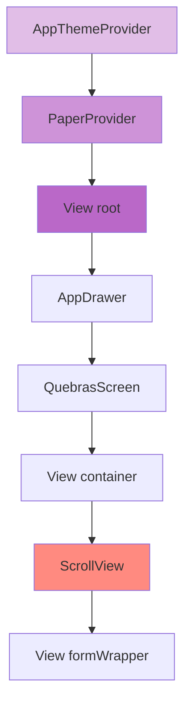

# Ajustes no Tema Escuro do ScrollView

## Problema
O ScrollView na tela de Quebras não está adotando corretamente a cor de fundo escura quando o tema escuro está ativado.

## Análise
- O tema escuro está configurado corretamente no `ThemeContext.tsx`
- O `customDarkTheme.ts` estende o `MD3DarkTheme`
- A estrutura de componentes está correta, com o `PaperProvider` envolvendo a aplicação
- O ScrollView está dentro de uma View com `flex: 1` mas não tem sua própria cor de fundo definida

## Hierarquia de Componentes


## Solução Proposta

### 1. Modificações no QuebrasScreen.tsx

#### Container Principal
```typescript
return (
  <View style={[styles.container, { backgroundColor: theme.colors.background }]}>
    {/* ... resto do código ... */}
  </View>
);
```

#### ScrollView
```typescript
<ScrollView 
  keyboardShouldPersistTaps={'handled'}
  style={{
    backgroundColor: theme.colors.background,
    flexGrow: 1
  }}
  contentContainerStyle={{
    flexGrow: 1
  }}
>
```

#### Estilos Atualizados
```typescript
const styles = StyleSheet.create({
  container: {
    flex: 1,
  },
  formWrapper: {
    margin: 16,
    flex: 1, // Garantir que o conteúdo preencha o ScrollView
  },
  // ... resto dos estilos ...
});
```

### 2. Verificação do Tema
Adicionar console.log temporário no QuebrasScreen para debug:
```typescript
export default function ProdutosScreen() {
  const theme = useTheme();
  console.log('Theme colors:', theme.colors);
  // ... resto do código ...
}
```

## Próximos Passos
1. Implementar as modificações no código usando o modo Code
2. Testar a aplicação com o tema escuro ativado
3. Verificar se o ScrollView e todos os componentes filhos estão adotando corretamente as cores do tema
4. Remover o console.log de debug após confirmar que está funcionando

## Observações
- As modificações garantem que tanto o container quanto o ScrollView tenham a cor de fundo do tema
- O flexGrow no ScrollView e seu contentContainer ajuda a garantir que todo o espaço disponível seja preenchido
- A cor de fundo é aplicada em cascata do container pai até os componentes filhos